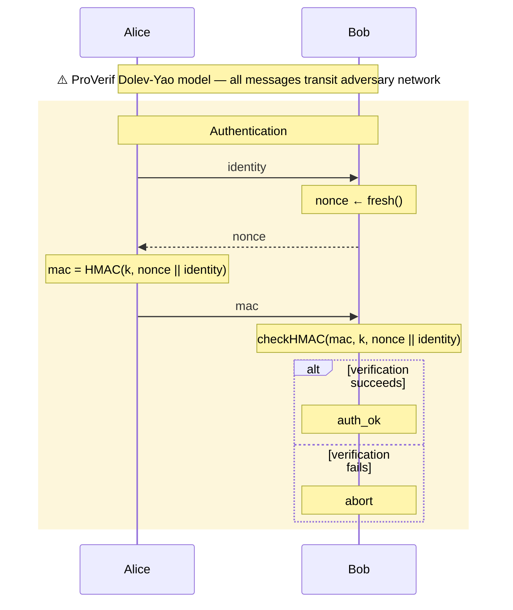

# Expected Output: simple-proverif

This is the exact ASCII diagram and Mermaid file the `crypto-protocol-diagram`
skill should produce when given `model.pv` as input.

---

## Step 0 classification

Input: `model.pv` — ProVerif file (`.pv` extension, contains `process`, `let`,
`in`/`out`). Input type: **Spec (ProVerif)**.

## Step S2: Parties extracted

- `AliceProc` → participant `A as Alice`
- `BobProc` → participant `B as Bob`

## Step S3: Message flow (channel `c`)

| # | `out` | `in` | Message |
|---|-------|------|---------|
| 1 | `AliceProc` | `BobProc` | `identity` |
| 2 | `BobProc` | `AliceProc` | `nonce` (fresh) |
| 3 | `AliceProc` | `BobProc` | `mac = HMAC(k, nonce \|\| identity)` |
| 4 | `BobProc` | — | `true` (auth success, conditional) |

## Step S4: Crypto operations

- `AliceProc`: `hmac(key, concat(nonce, identity))` → `Note over A: mac = HMAC(k, nonce \|\| id)`
- `BobProc`: `new nonce` → `Note over B: nonce ← fresh()`
- `BobProc`: `checkhmac(mac, key, ...)` → `alt` block (verify succeeds / fails)

## Step S5: Ambiguities

- Dolev-Yao model applies: annotate with `⚠️`
- Auth success sends `true` over `c` — in a real protocol this would be
  implicit; annotate as optional output

---

## Inline ASCII Diagram

```
Protocol: HMAC Challenge-Response Authentication (ProVerif model)
Output:   hmac-challenge-response.md

Alice                    Bob
   |                      |
   |   -- Authentication  |  --
   |                      |
   +--------------------->|  identity
   |                      |
   |                      +--.
   |                      |  | nonce ← fresh()
   |                      |<-'
   |                      |
   |       nonce          |
   |<- - - - - - - - - - -+
   |                      |
   +--.                   |
   |  | mac = HMAC(k,     |
   |  | nonce || id)      |
   |<-'                   |
   |                      |
   +--------------------->|  mac
   |                      |
   |                      +--.
   |                      |  | checkHMAC(mac, k,
   |                      |  | nonce || identity)
   |                      |<-'
   |                      |
   |  [on verify success] |
   |                      +----.
   |                      |    | auth_ok
   |                      |<---'
   |                      |
   |  [on verify failure] |
   |                      | (abort)

⚠️ ProVerif note: all messages transit adversary network (Dolev-Yao model)
```

## Protocol Summary

- **Parties:** Alice (initiator), Bob (responder/verifier)
- **Round complexity:** 1.5 RTT (3 messages)
- **Key primitives:** HMAC with shared symmetric key; fresh nonce
- **Authentication:** Unilateral (Alice authenticates to Bob only)
- **Forward secrecy:** No (static shared key `k`; compromise reveals all sessions)
- **Notable:** `query attacker(k)` verifies the shared key remains secret under
  Dolev-Yao. No mutual authentication — Bob does not prove identity to Alice.

---

## Mermaid File: hmac-challenge-response.md

````markdown
# HMAC Challenge-Response Authentication Sequence Diagram



## Protocol Summary

- **Parties:** Alice (initiator), Bob (responder)
- **Round complexity:** 1.5 RTT (3 messages)
- **Key primitives:** HMAC with shared symmetric key; fresh nonce
- **Authentication:** Unilateral (Alice → Bob only)
- **Forward secrecy:** No
- **Notable:** No mutual authentication. `query attacker(k)` checks key secrecy.
````
