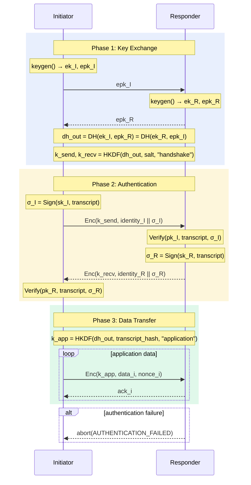

# Mermaid Sequence Diagram Syntax Reference

## Basic Structure

```
sequenceDiagram
    participant A as Alice
    participant B as Bob
    A->>B: Hello
    B-->>A: Hi
```

Every sequence diagram starts with `sequenceDiagram` on its own line (no
indentation). Participants are declared with `participant` before they appear
in messages; if undeclared, Mermaid auto-creates them in order of first
appearance — but always declare explicitly for crypto protocols to control
ordering.

---

## Participant Declarations

```
participant A             # ID = display name
participant A as Alice    # short ID, long display name
actor A as Alice          # person icon instead of box
```

**Ordering:** Participants are rendered left-to-right in declaration order.
Arrange them so that the dominant message direction flows left-to-right:
Initiator → Responder, Client → Server, Prover → Verifier.

**Naming conventions for crypto:**

| Role | Suggested ID | Display name |
|------|-------------|--------------|
| Initiator | `I` | Initiator |
| Responder | `R` | Responder |
| Client | `C` | Client |
| Server | `S` | Server |
| Trusted third party | `TTP` | TTP |
| Prover | `P` | Prover |
| Verifier | `V` | Verifier |
| Dealer | `D` | Dealer |
| Party i | `P1`, `P2`, … | Party 1, Party 2, … |
| Certificate Authority | `CA` | CA |

---

## Arrow Types

| Syntax | Arrow | Use for |
|--------|-------|---------|
| `A->>B: msg` | solid, open arrowhead | synchronous message send |
| `A-->>B: msg` | dashed, open arrowhead | reply / response |
| `A->B: msg` | solid, no arrowhead | passive / internal note |
| `A-->B: msg` | dashed, no arrowhead | async / passive reply |
| `A-xB: msg` | solid, X head | message lost / dropped |
| `A--xB: msg` | dashed, X head | async lost message |
| `A-)B: msg` | solid, async arrowhead | fire-and-forget |
| `A--)B: msg` | dashed, async arrowhead | async reply |

**For crypto protocols**, use `->>` for all protocol messages and `-->>` for
responses/replies. Reserve `-->` and `--x` for error/abort paths inside `alt`
blocks.

---

## Notes

Attach explanatory text to one or two participants:

```
Note over A: keygen() → pk, sk
Note over A,B: shared_secret = DH(sk_A, pk_B)
Note right of A: internal computation
Note left of B: validation step
```

Use `Note over` for cryptographic operations that happen at a party without
a message being sent. Use `Note over A,B` to annotate a shared computation or
the meaning of a message between them.

**Keep notes short.** Use mathematical shorthand:
- `HKDF(IKM=DH_out, salt, info) → k`
- `Sign(sk, transcript) → σ`
- `Verify(pk, transcript, σ)`
- `Enc(k, plaintext, AD) → ct || tag`
- `H(nonce || msg) → c`

---

## Activation Bars

Show when a participant is "active" (processing):

```
activate A
A->>B: request
B-->>A: response
deactivate A
```

Or inline with `+` / `-`:

```
A->>+B: request
B-->>-A: response
```

Use activations sparingly in protocol diagrams — they add noise unless the
protocol has clear request/response pairing that benefits from showing
duration.

---

## Grouping Blocks

### `rect` — colored background region

```
rect rgba(100, 149, 237, 0.15)
    Note over I,R: Phase 1: Key Exchange
    I->>R: ephemeral_pk
    R-->>I: ephemeral_pk
end
```

Use `rect` with a distinct color per protocol phase. Suggested palette:

| Phase | Color |
|-------|-------|
| Setup / Key Generation | `rgba(100, 149, 237, 0.15)` — blue |
| Handshake | `rgba(46, 204, 113, 0.15)` — green |
| Authentication | `rgba(241, 196, 15, 0.15)` — yellow |
| Key Derivation | `rgba(155, 89, 182, 0.15)` — purple |
| Data Transfer | `rgba(230, 196, 15, 0.12)` — gold |
| Error / Abort | `rgba(231, 76, 60, 0.15)` — red |

### `loop` — repeated block

```
loop for each data chunk
    A->>B: Enc(k, chunk_i) → ct_i
    B-->>A: ack
end
```

Use `loop` when a message exchange repeats N times. Avoid unrolling loops that
would add 5+ identical arrow pairs.

### `alt` — conditional / branching

```
alt verification succeeds
    B-->>A: session_key
else verification fails
    B-->>A: abort
end
```

Use `alt` for protocol branches: success path vs. abort/error paths. Always
show the error path — it's where security properties break down.

### `opt` — optional block

```
opt if session resumption requested
    A->>B: session_ticket
end
```

Use `opt` for optional protocol extensions (e.g. session resumption, renegotiation).

### `par` — parallel execution

```
par
    A->>B: msg_1
and
    A->>C: msg_2
end
```

Use `par` for genuinely concurrent sends (broadcast in MPC, simultaneous sends
to multiple parties).

### `critical` — mutual exclusion region

```
critical database access
    A->>DB: update
end
```

Rarely needed in protocol diagrams; use for atomic operations if relevant.

---

## Message Labels

Labels appear after the colon on arrow lines:

```
A->>B: ClientHello(random, cipher_suites, extensions)
B-->>A: ServerHello(random, chosen_cipher, session_id)
```

**Formatting guidance:**

- Use `FieldName(value)` or `Type{field: value, ...}` for structured messages
- Use `||` for concatenation: `nonce || ciphertext || tag`
- Use `→` to show output of a computation in a note: `KDF(shared) → k_enc, k_mac`
- Keep labels under ~60 characters; move detail into `Note over` annotations
- Subscript with underscore: `pk_e` (ephemeral pubkey), `k_1`, `σ_A`

---

## Common Pitfalls

### Colon in message label breaks parsing

**Broken:**
```
A->>B: key: value
```

**Fixed:** Use HTML entity or restructure:
```
A->>B: key=value
A->>B: "key: value"
```

### Special characters in participant IDs

Participant IDs must be alphanumeric + underscore. Avoid spaces, hyphens,
brackets.

**Broken:**
```
participant Party-1
```

**Fixed:**
```
participant P1 as Party 1
```

### `end` keyword clash

If a message label contains the word `end`, it may terminate a block early.
Quote it or rephrase.

### Unclosed blocks

Every `rect`, `loop`, `alt`, `opt`, `par` must have a matching `end`. Missing
`end` causes the entire diagram to fail silently.

### Long label lines

Labels longer than ~80 characters may overflow in some renderers. Break across
multiple notes rather than one very long label.

### `Note over A,B` with wrong participant order

The two participants in `Note over A,B` must be in left-to-right declaration
order, not reversed. `Note over B,A` when A is declared before B will fail in
some renderers.

---

## Complete Example


