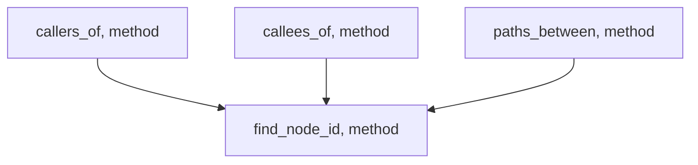
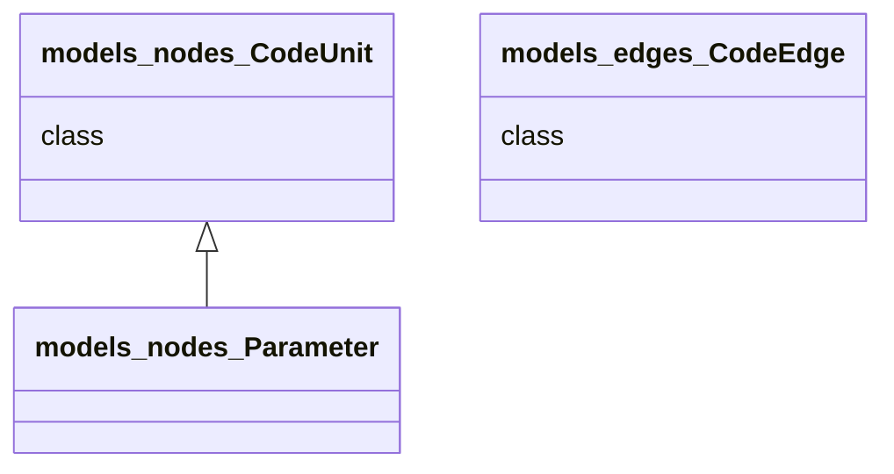
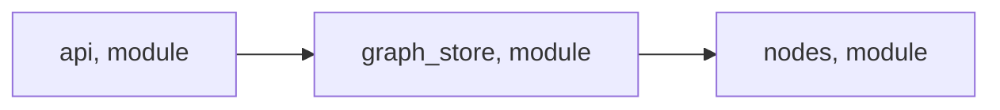
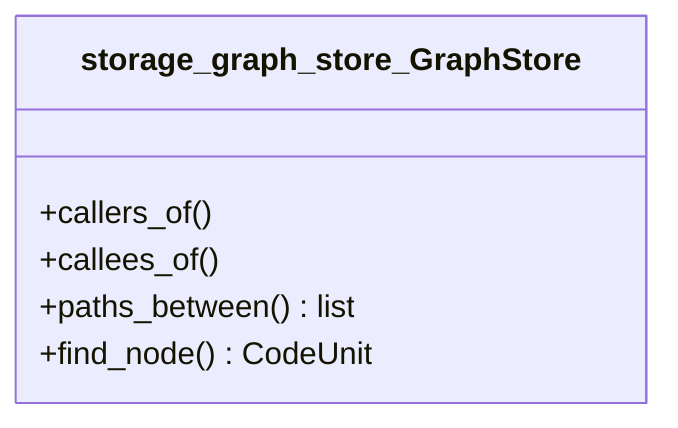

# Diagram Types

## Contents

- [Call graph](#call-graph)
- [Class hierarchy](#class-hierarchy)
- [Module dependencies](#module-dependencies)
- [Containment](#containment)
- [Complexity heatmap](#complexity-heatmap)
- [Attack surface / data flow](#attack-surface--data-flow)

---

## Call Graph

Shows which functions call which. Built from `callers_of` / `callees_of`
queries and `calls` edges.

**Mermaid type:** `flowchart`

**When to use `--focus`:** Almost always. Without focus, large codebases
produce unreadable diagrams. Start with `--depth 2` and increase if needed.

**Arrow styles reflect edge confidence:**
- Solid (`-->`) = certain (direct call)
- Dashed (`-.->`) = inferred (attribute access on non-self)
- Dotted (`..->`) = uncertain (dynamic dispatch)

**Example output:**



**Script invocation:**

```bash
uv run {baseDir}/scripts/diagram.py \
    --target {targetDir} --type call-graph \
    --focus QueryEngine --depth 2
```

---

## Class Hierarchy

Shows inheritance (`<|--`) and interface implementation (`<|..`)
relationships between classes, structs, interfaces, and traits.

**Mermaid type:** `classDiagram`

**Limitations:** Languages without class inheritance (e.g., Go, C) produce
empty diagrams. The script emits a note node in that case.

**Example output:**



**Script invocation:**

```bash
uv run {baseDir}/scripts/diagram.py \
    --target {targetDir} --type class-hierarchy
```

---

## Module Dependencies

Shows import relationships between modules. Built from `imports` edges.

**Mermaid type:** `flowchart`

**Best with `--direction LR`** for left-to-right dependency flow.

**Example output:**



**Script invocation:**

```bash
uv run {baseDir}/scripts/diagram.py \
    --target {targetDir} --type module-deps --direction LR
```

---

## Containment

Shows classes and their member functions/methods using `contains` edges.

**Mermaid type:** `classDiagram` (with member lists)

**Example output:**



**Script invocation:**

```bash
uv run {baseDir}/scripts/diagram.py \
    --target {targetDir} --type containment
```

---

## Complexity Heatmap

Shows functions color-coded by cyclomatic complexity with call edges
between them. Only nodes meeting `--threshold` are included.

**Mermaid type:** `flowchart` with `classDef` styles

**Color scale:**
- Green (`low`): CC < 5
- Yellow (`medium`): CC 5-10
- Red (`high`): CC > 10

**Example output:**

```mermaid
flowchart TB
    parsers_python_parser_parse_file["parse_file, method, CC=15"]:::high
    parsers_python_parser_visit_class["visit_class, method, CC=8"]:::medium
    parsers_python_parser_parse_file --> parsers_python_parser_visit_class
    classDef low fill:rgba(40,167,69,0.2),stroke:#28a745,color:#28a745
    classDef medium fill:rgba(255,193,7,0.2),stroke:#e6a817,color:#e6a817
    classDef high fill:rgba(220,53,69,0.2),stroke:#dc3545,color:#dc3545
```

**Script invocation:**

```bash
uv run {baseDir}/scripts/diagram.py \
    --target {targetDir} --type complexity --threshold 5
```

---

## Attack Surface / Data Flow

Shows paths from entrypoints (user input, API endpoints) to sensitive
functions. Entrypoints are styled distinctly (rounded rectangles, blue).

**Mermaid type:** `flowchart`

Without `--focus`, the script targets the top 10 complexity hotspots
reachable from entrypoints. With `--focus`, it shows all paths from
entrypoints to the specified function.

**Example output:**

```mermaid
flowchart TB
    handle_request(["handle_request, function"]):::entrypoint
    validate_input["validate_input, function"]
    execute_query["execute_query, function"]
    handle_request --> validate_input
    validate_input --> execute_query
    classDef entrypoint fill:rgba(0,123,255,0.2),stroke:#007bff,color:#007bff
```

**Script invocation:**

```bash
# Focus on a specific sensitive function
uv run {baseDir}/scripts/diagram.py \
    --target {targetDir} --type data-flow \
    --focus execute_query

# Auto-detect: entrypoints to top complexity hotspots
uv run {baseDir}/scripts/diagram.py \
    --target {targetDir} --type data-flow
```
