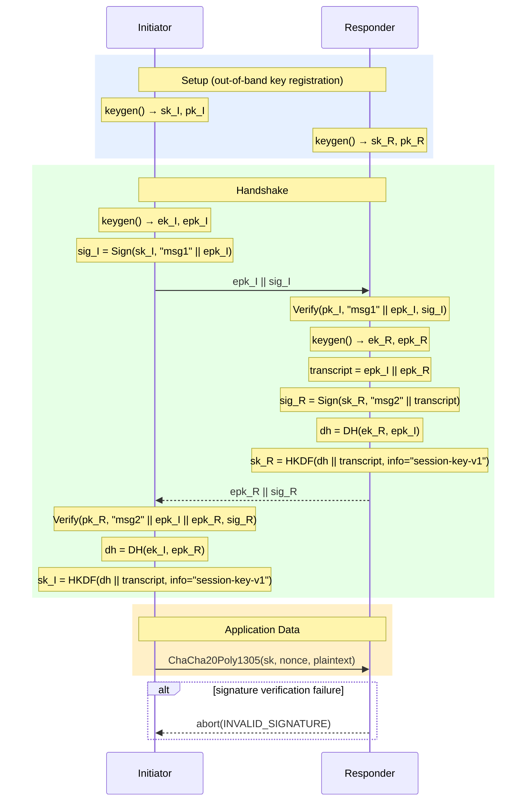

# Simple Authenticated Key Exchange Sequence Diagram

## Protocol Summary

- **Parties:** Initiator (I), Responder (R)
- **Round complexity:** 2 messages (1 round-trip)
- **Key primitives:** X25519 (DH), Ed25519 (Sign/Verify), HKDF-SHA256, ChaCha20-Poly1305
- **Authentication:** Mutual — both parties sign their ephemeral key; both verify the peer's signature
- **Forward secrecy:** Yes — session key derived exclusively from ephemeral DH; long-term keys only used for authentication
- **Notable:** Long-term keys registered out-of-band; no PKI or certificate exchange in-protocol
